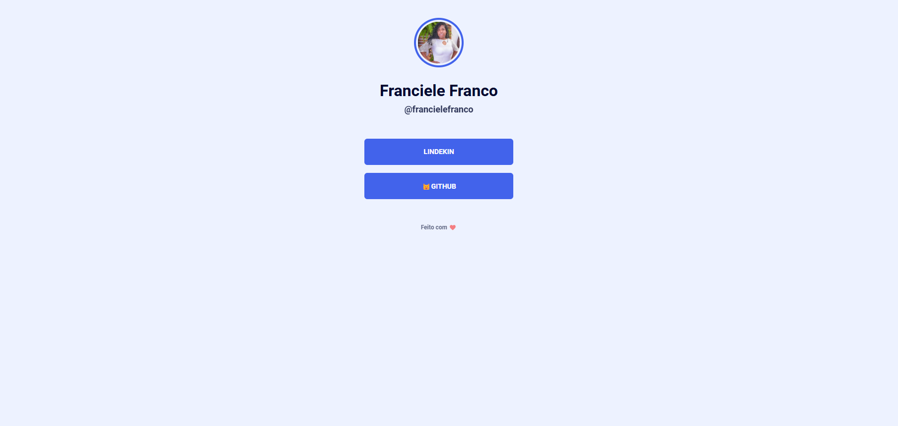

# Nome do Projeto:  maratona-explorer-2




## Descrição

  maratona-explorer-2 é uma página simples em HTML e CSS que funciona como um cartão de visita digital. A página exibe uma foto de perfil, o nome do usuário e links para suas redes sociais, como LinkedIn e GitHub. O objetivo deste projeto é criar um portfólio pessoal acessível e visualmente agradável para compartilhar suas informações de contato.

## Funcionalidades

- Exibição da foto de perfil, nome e nome de usuário.
- Links para redes sociais (LinkedIn e GitHub).
- Design responsivo utilizando CSS.
- Layout simples e funcional.

## Tecnologias Utilizadas

- **HTML5:** Estrutura da página.
- **CSS3:** Estilização e responsividade.
- **Google Fonts:** Tipografia customizada.

## Como Executar o Projeto

1. Clone o repositório ou faça o download dos arquivos:

   ```bash
   git clone https://github.com/seu-usuario/seu-repositorio.git
   ```

2. Abra a pasta do projeto:

   ```bash
   cd maratona-explorer-2
   ```

3. Execute o arquivo `index.html` em qualquer navegador para visualizar a página.


## Recursos Utilizados

- **Google Fonts:** A página utiliza a fonte "Roboto" para uma tipografia moderna e legível.
- **Fontes de redes sociais:** Ícones simples para exibição de links para GitHub e LinkedIn.


